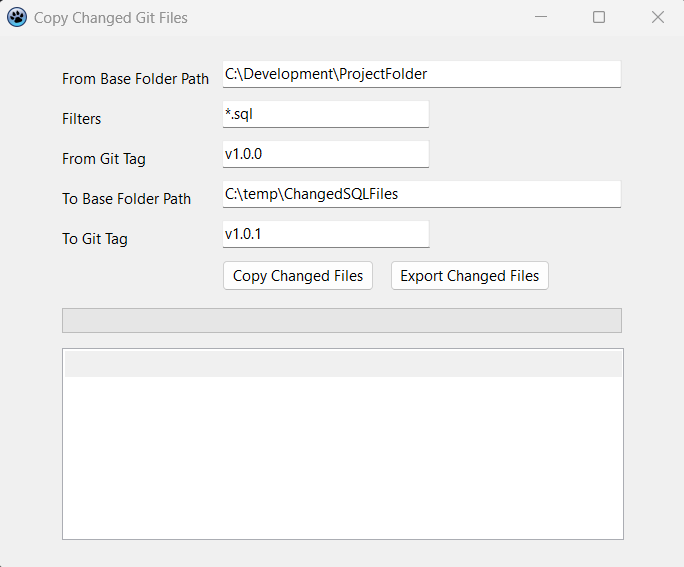

# Copy Changed Git Files

A simple Windows GUI tool (built with Lazarus/Free Pascal) that extracts all changed files (e.g. `.sql`) between two Git tags and copies them to a target folder. Ideal for developers needing to export change sets between releases.

---

## ✨ Features

- Compare a Git working directory to a specific tag (`git diff --name-only`)
- Filter files by extension (e.g. `*.sql`)
- Copy changed files while preserving folder structure
- Prevent overwriting if target folder already exists and contains files
- Export the copied file list to a `.csv`
- Settings are automatically saved to an `.ini` file next to the executable

---

## 🖼️ UI Preview

---

## 🧰 Requirements

- [Git](https://git-scm.com/) installed and available in system `PATH`
- Windows OS
- Lazarus (Free Pascal) to build from source

---

## 🛠️ Usage

📥 **Download the latest `.exe`** from the [Releases page](https://github.com/NielBuys/git-changed-copier/releases) and run it — no installation required.

1. **From Base Folder Path**: Root of the Git working directory
2. **Filters**: File types to include (e.g. `*.sql`)
3. **From Git Tag**: Older tag to compare from (e.g. `v2.38.0n`)
4. **To Base Folder Path**: Root folder where copied files should be saved
5. **To Git Tag**: Subfolder name (e.g. `v2.39.0n`)

Click **"Copy Changed Files"** to extract and copy.  
Click **"Export Changed Files"** to save the file list to a `.csv`.

---

## 📁 INI File Settings

On form close, the app saves the last-used settings to `ChangedGitFiles.ini` in the executable folder. These are reloaded when the app starts.

---

## 📦 Build From Source

1. Open the project `.lpi` file in [Lazarus](https://www.lazarus-ide.org/)
2. Compile and run

---

## 📄 License

This project is open-source under the MIT License.
